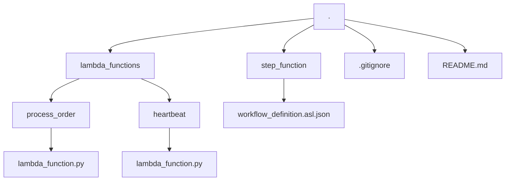

# AWS-Serverless-Order-Processing-Pipeline
This project demonstrates a simple, event-driven serverless workflow on AWS for processing orders. It integrates several key AWS services to create a robust and scalable pipeline, from message queuing to workflow orchestration and user notification.

File Structure

Architecture
The pipeline follows an event-driven pattern. An order message is sent to an SQS queue, which triggers a Step Functions workflow. This workflow orchestrates a Lambda function that handles the core business logic: logging the event, sending a confirmation email via SES, and publishing a notification to an SNS topic.

Code snippet

graph TD
    subgraph "Order Ingestion"
        A[SQS Queue: SimpleOrderQueue]
    end

    subgraph "Workflow Orchestration"
        B(Step Function: SimpleOrderWorkflow)
    end

    subgraph "Core Processing"
        C{Lambda: ProcessOrderFunction}
    end

    subgraph "Notifications & Logging"
        D[SES: Confirmation Email]
        E[SNS: Order Notification]
        F[CloudWatch Logs]
    end

    subgraph "Scheduled Heartbeat"
        G(EventBridge Scheduler) --> H{Lambda: HeartbeatFunction} --> F
    end

    A --> B --> C
    C --> D
    C --> E
    C --> F
AWS Services Used
📬 Amazon SQS: Decouples the order submission from the processing logic.

🔗 AWS Step Functions: Orchestrates the order processing workflow.

⚙️ AWS Lambda: Executes the core business logic.

📧 Amazon SES: Sends order confirmation emails to customers.

📣 Amazon SNS: Publishes notifications for processed orders.

⏰ Amazon EventBridge: Triggers a scheduled "heartbeat" Lambda function.

📊 Amazon CloudWatch: Provides logging and monitoring for all services.

🔒 AWS IAM: Manages permissions and roles for services.

Setup and Deployment
This project was deployed manually using the AWS Management Console.

Prerequisites
An AWS Account.

An IAM user with permissions for the services listed above.

A verified email identity in Amazon SES.

Deployment Steps
Create Resources: Manually create the SQS queue, SNS topic, and Lambda functions as described in the assignment. The code for the Lambda functions can be found in the lambda_functions/ directory.

Configure Lambda:

Add the necessary IAM permissions (AmazonSESFullAccess, AmazonSNSFullAccess) to the ProcessOrderFunction's execution role.

Set the SNS_TOPIC_ARN environment variable in the ProcessOrderFunction.

Define State Machine: Create the Step Functions state machine. The definition (Amazon States Language) is provided in step_function/workflow_definition.asl.json.

Create Heartbeat: Create the HeartbeatFunction and the EventBridge rule to trigger it on a schedule.

Usage
To test the pipeline:

Navigate to the Step Functions console.

Select the SimpleOrderWorkflow state machine and click Start execution.

Provide the following JSON payload as input, replacing the email with your verified SES email address:

JSON

{
  "orderId": "001",
  "customerEmail": "your-verified-email@example.com"
}
Upon successful execution, you should receive a confirmation email (from SES) and a notification email (from your SNS subscription). The execution logs can be viewed in CloudWatch.
